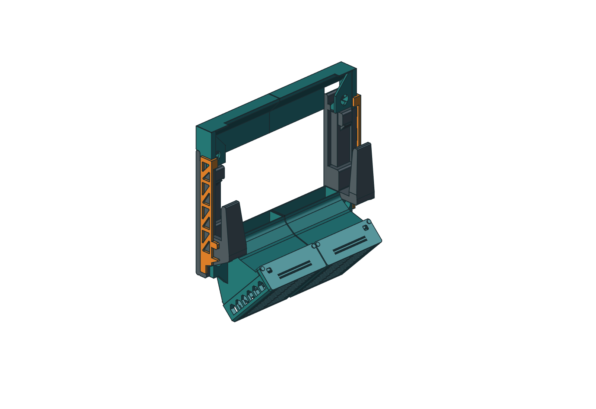

# Laptop wall mount — Minimalist M1 and ducted Rev H

Two independent prototypes: **Minimalist M1** uses lighter open arms and fan
cradles with an optional indexed airflow dam; **Rev H** preserves the ducted
prototype and its already-printed arms. Future ducted revisions can change the
arms, size range and airflow adjustment too.

[Explore both designs](https://thereprocase.github.io/dell-5560-wall-mount/) ·
[Print and assembly guide](https://thereprocase.github.io/dell-5560-wall-mount/minimalist-guide.html)

## MakerWorld preparation package

[Agent handoff](MAKERWORLD_HANDOFF.md) · [Dated package, gallery, and downloads](makerworld/2026-09-08/)

Three listing drafts and sixty native Bambu Studio projects are archived while
physical prints and lab photographs are completed. The new profiles use 20%
gyroid infill and have virtual review only. All remain physically untested.

## Minimalist M1.1

[5560 native + print package](docs/downloads/Minimalist_M1_5560.zip) ·
[Fit coupon package](docs/downloads/Minimalist_M1_Fit_Coupons.zip) ·
[Editable nominal FreeCAD](minimalist/Laptop_Wall_Mount_Minimalist.FCStd) ·
[Six native size presets](minimalist/presets/) ·
[Construction and validation](minimalist/README.md)

The nominal complete set is **400.55 g / 15 h 42 m 30 s** in OrcaSlicer 2.4.2,
using P1S / ASA / 0.4 mm / 0.20 mm / 6 walls / 100% fill / 8 mm brim. That is
66.2% less estimated filament than the full Rev H set under the same process.
Times include each layout's plate overhead. These are slicer estimates, not
measured printing or cooling results.

Print one each of **01–08 plus 21_all_hardware**: nine plates. The twelve
individual files 09–20 are alternatives for replacement hardware, already
included on plate 21. STEP, STL and geometry-only 3MF are alternative formats.
The assembled STEP is for inspection. Keep the supplied print orientations.

All six dimensioned width/depth/thickness examples were recomputed at all nine
dam indices. Native geometry, intended 0.30 mm gaps, saved/reopened models,
STEP roundtrips, closed meshes and bed/brim/cutter clearance passed. Nominal
Orca paths have no disconnected floating components. The expanded screen
finds up to 8.99 mm of overhang-wall path without prior-layer support; the
bridge-tagged maximum is 3.02 mm. The coupon includes the fan-hanger and dam
slot interfaces in their full-part build directions. Physical fit, printed
retention, long-term ASA creep, anchors and cooling remain to be qualified.

### M1.1: carry the wall pad into the arm

Printing an arm on its side puts much of its load path within the layers, but
its wall pads extend beyond the arm’s 12 mm thickness. The original transition
left a small section just above that layer. The reinforcement grows each pad
from 24 to 32 mm tall and adds a pair of 6 mm webs, tapering 16 mm forward from
the pad face. Their roots run through the full arm thickness, including the
nearby window, so they begin at the bed instead of bridging onto a late layer.

| Original junction | Reinforced junction |
|---|---|
|  |  |

Gold shows added material in the native CAD comparison; the arm prints as one
fused part. Bolt centers and bores stay at their existing locations. The upper
dam has a matching tapered clearance notch so it can still traverse all nine
ladder positions. **Upgrade arms 01 and 02, plus dams 07 and 08 if using the dam**; the other sixteen
parts retain their geometry.

At a section just beyond the original 12 mm arm thickness, the material area
in each wall junction increases from **192 to approximately 416 mm²**. The
nominal arm pair adds **13.54 g of solid CAD** at 1.05 g/cm³. This is an area
comparison, not a claim of doubled tested strength: warm ASA, layer bonding,
fasteners and wall anchors still need physical qualification.

The revised complete set adds **12.50 g and 17 m 36 s** in Orca compared with
M1.0; the dam relief offsets a little of the extra arm material.

[Section data and assumptions](minimalist/reports/wall-transition-review.json) ·
[Native section calculation](minimalist/wall_transition_review.py)

## Ducted Rev H prototype

[All 14 print-oriented STEP files + corrected Orca previews](docs/downloads/Precision_5560_RevH_Prototype_STEP.zip) ·
[Orca bridge instructions](print_release_step/ORCA_BRIDGE_REVIEW.txt) ·
[STL/3MF print set](print_release/) ·
[Native FreeCAD](freecad/Precision_5560_Native.FCStd) ·
[Assembled STEP](freecad/Precision_5560_Native.step)

For ducts 03 and 04, keep the baked inlet-down orientation and set both
**Bridge direction and Internal bridge direction to 180°**, with Relative
bridge angle and Align infill direction to model off. Automatic direction
runs lengthwise along the slots. The corrected paths cross them, with a
maximum unsupported span of 5.19 mm and no disconnected floating components.
This is a toolpath screen, not an ASA bridge test. Re-slice for your spool.

The original `print_ready/`, root STEP, CadQuery source and Fusion/Onshape
ports remain **Revision F history/baselines**. Rev H's arm geometry is preserved
as prototype history; it is not a permanent constraint on later designs.

### H-R1: removable retention for your printed arms

[Interactive model and installation guide](https://thereprocase.github.io/dell-5560-wall-mount/revh-retainers.html) ·
[Four-part add-on and fit coupon](docs/downloads/Precision_5560_RevH_Removable_Retainers_R1.zip) ·
[Editable native model and engineering notes](revh_retention/)

Two external side bars and two keyed keepers retain the ducts and upper rails
without changing any of the fourteen Rev H parts. They engage existing arm
windows, so the already printed arms need no drilling or reprinting. Removing
one side bar releases both its duct and rail; support both while servicing.

Start with the short right-arm fit coupon. This is a CAD-checked prototype;
physical retention, bar stiffness and warm ASA creep still need testing.

## How the shape was developed

The design story and its working images belong here alongside the finished
files. These stages describe the **original Revision F ducted prototype**:
its dimensions, fixed joints and historical simulation results are recorded
as they were developed. Minimalist M1 uses its own arms, shorter front tines
and removable ladder keys; use the current guide above for printing it.

### 1. Define fit and access

> “The hinge will go up so that the hot air escapes up and the fans can go on the bottom…”

The laptop sits vertically, underside toward the wall, with a 40 mm rear gap. A 344.4 × 230.3 × 20 mm envelope controls fit. The 26 mm bare slot allows for contact pads.

> “…make the tines on the front a little bit taller…”

The front tines are 94 mm tall. Four Ø7 mm wall holes face the room through clear Ø16 mm tool paths. We checked bolt access and laptop removal with the assembly in place. The laptop needs a 105 mm lift before moving forward; allow 110 mm overhead.

### 2. Support the laptop's intake

> “…doesn't have to seal, just has to be high pressure at vent high velocity beyond.”

The airflow goal became a plenum with a controlled outlet. Side cheeks limit leakage. A separate upper rail contracts the gap above the intake band, keeping the laptop vertical and the outlet width interchangeable.

Restricting the outlet can raise upstream pressure while reducing flow. The useful question was how much pressure each slot retained at the intake, and what exit velocity remained.

### 3. Locate the active vents

> “…download and scale images and cross sections of the machine to estimate its profile geometry?”

We scaled Dell side views and an inside-base-cover image against the published width and depth. The inside view revealed a covered center behind the broad exterior grille, leaving two estimated 70 × 40 mm intake regions near X = ±111 mm.

The estimated intake band ends near Z = 191 mm, with ±4 mm location uncertainty. The contraction starts at 198 mm, reaches its throat at 226 mm and exits at 232 mm, near the hinge. No dimensioned factory section was found; the reconstructed profile has an estimated ±2 mm uncertainty. Check the actual machine before assembly.

The [profile reconstruction data](profile_reconstruction.json) retain the pixel picks, scale factors, source hashes and uncertainty. The [estimated-profile STEP](REFERENCE_Estimated_Laptop_Profile.step) is the resulting reference shape, not manufacturer CAD.

### 4. Design for the print orientation

> “I would like to print the brackets on their side for strength, and not on their back.”

> “Also bridges are just fine, they're usually printable. Unsupported overhangs are bad.”

The brackets print on their outer sides. Ducts print inlet down; outlet rails print lip down. Sloped roofs support the next layer, while short bridges close box sections and dovetail grooves.

At the Revision F checkpoint, the 0.20 mm geometric layer audit found no floating starts and an 18 mm longest intentional bridge. Each part and its 8 mm brim fit the P1S bed and avoided the cutter exclusion. That was a geometry screen, before an actual slicer review. The later Rev H Orca review above caught a lengthwise bridge across a long slot and corrected its direction; physical ASA bridge quality still needs a print check.

### 5. Reduce material along the load path

> “I feel like we could get really creative and save a ton of plastic here.”

We hollowed the brackets, thinned the duct skins and pocketed the trays and caps. Material remains at bearing shoulders, bracket roots and wall holes. This used explicit geometry and section calculations; no topology or generative solver was run.

We extracted net section properties every 0.5 mm, including voids and unsymmetric bending. The structural screen uses a 2.5 kg laptop, 6 kg installation, 3g acceleration and a 50 N outward hinge pull. The minimum ratio of assumed stress limit to calculated stress is 1.19. This is a screening result; bonds, anchors and warm ASA creep remain unqualified.

Revision F uses **1,177.3 cm³ of solid CAD, 35.0% less than Revision D** at equal fill policy. The latest containment and assembly changes add 13.1 cm³ to the lightweight Revision E.

### 6. Keep service parts removable

> “Can we also make it tool free / ca glue assembly, except for the four wall bolts?”

Keyed lap joints connect the fixed ducts and outlet rails. Their shoulders carry vertical load; CA resists withdrawal. Fan trays slide in dry, and two split pins retain each cap.

> “…have the fans angle down so they're blowing at a 45 to the gap instead of straight in?”

The fan intakes face down and outward. Air flows upward and wallward at 45°. Cheeks contain the rear flow while leaving side ports accessible.

The screened loads require 47.8 N of outward retention per duct and 7.4 N per pin. Adhesive and pin tests must establish that retention before service.

### 7. Compare the outlet slots

> “And do some cfd to design the plenum and slot?”

Eight OpenFOAM v1912 cases compare slot width, lower-turn geometry, mesh size, supply pressure and intake demand. The model uses steady incompressible RANS with k–omega SST in a sealed 2D section.

At an assumed 20 Pa inlet total pressure and prescribed 0.4 m/s intake demand:

| Outlet | Mean intake pressure | Mean exit speed |
|---|---:|---:|
| 8 mm | 18.80 Pa | 4.01 m/s |
| **12 mm** | **17.67 Pa** | **4.42 m/s** |
| 16 mm | 15.43 Pa | 5.16 m/s |

The narrow slot retained more pressure; the wide slot produced a faster exit. We kept **12 mm** as the starting compromise. The curved lower turn improved intake pressure by only 0.11 Pa on the common mesh, giving little reason to refine the bend further before testing.

All meshes passed `checkMesh`. Flow imbalance stayed below 0.001%; mesh refinement changed mean intake pressure by about 0.3% and exit speed by 2.9%. Four cases missed the strict residual target despite stable mean-pressure monitors.

The model prescribes laptop intake flow and assumes fan pressure. It omits real fan curves, internal laptop resistance, side leakage, heat transfer and the room plume. The results compare slot behavior; actual cooling, total CFM and exhaust carry distance require measurements.

### 8. Specify the fits

> “what tolerances did you assume for slide to fit parts?”

The dovetail has 0.30 mm horizontal allowance per side, 0.30 mm crown clearance and 0.20 mm root clearance. Clearance normal to the sloping flank is smaller. Fixed-key pockets use 0.30 mm nominal offsets plus roof relief. Pins use a Ø4.0 mm shaft, Ø4.1 mm socket and Ø4.2 mm split crown.

No global ASA shrink correction is applied. Print the coupons, inspect elephant foot and adjust individual interfaces as needed. Full-length tray engagement also needs a warping check. See [TOLERANCES.md](TOLERANCES.md).

### 9. Reproduce and test

The workflow followed the interfaces: establish fit, reconstruct the vents, build the solids, check loads and service motions, audit print support, then compare airflow variants. [DIALOGUE.md](DIALOGUE.md) preserves the available prompts in order.

| Software | Use |
|---|---|
| Python 3.12; CadQuery 2.8.0 / Open CASCADE | Parametric solids, sections, STEP export and interference checks |
| NumPy; trimesh 5.1.0; Shapely 2.1.2; rtree; NetworkX | Mesh, layer support and connectivity checks |
| Pillow | CAD renders and reference-image annotations |
| Matplotlib; SciPy; VTK | CFD postprocessing and field plots |
| OpenFOAM v1912 | Meshing, mesh checks, flow solution and field export |
| Bambu Studio 2.8.2.61 profile sources | Historical Revision F starting settings; current preparation uses OrcaSlicer |
| Git / GitHub | Source, design files and analysis records |

[PROCESS.md](PROCESS.md) gives the commands; [requirements.txt](requirements.txt) records the Python dependencies. The [engineering report](ENGINEERING_REPORT.md) covers dimensions, assumptions, loads and verification.

Next: measure the laptop, print the coupons, test joint retention and warm structural behavior, then measure intake pressure and workload temperatures with the selected fans and outlet rails. Use those results to decide whether a coupled 3D or thermal model would change the design.

**Printing:** follow the [P1S ASA guide](P1S_ASA_Print_Guide.md), retain the supplied orientations and inspect the slice. Files are standard 3MF/STL models. Print the individual parts; reference STEP assemblies are for fit inspection.

## Rev H engineering history

Revision H adds three R12 internal tangent blends per duct and two R14 exterior
support blends. Inlet/outlet profiles, printed arms, and 0.30 mm interfaces
remain unchanged. The other twelve parts retain the prior release geometry.
See [flow validation](freecad/flow_validation.json) for sampled wall thickness
and inlet-down overhang checks. Cooling performance has not been measured.

- Closed rail roofs and end windows while retaining the exhaust slot and open back.
- Contoured the rail shoulder with 0.30 mm clearance to the frozen printed arm.
- Rounded exposed tips, matched cover outlines, and used print-aware corner bevels.
- Set the cap/duct/tray interfaces to measured 0.30 mm gaps on both sides.
- Corrected dovetail clearance normal to the sloping flank.
- Added separate editable native loft-skin patches to close the unintended duct-wall notches.
- Preserved pin retention, fixed mounting shoulders, screw access and service motions.

Final CAD checks: **14 valid solids, 176 fully constrained sketches**, zero
additional wall loss, unchanged frozen arms, and passing sampled service paths.
All 14 print meshes are closed and their oriented bounds plus brims fit the P1S.
Physical fit, retention and ASA bridging remain to be checked. Both duct
toolpaths have now been screened with the corrected Orca bridge direction.

[Fit-and-finish review](freecad/ADJACENT_FIT_REVIEW.md) ·
[Native model guide](freecad/README.md) ·
[Final acceptance JSON](freecad/complete_fit_review.json) ·
[Print manifest](print_release/manifest.json)

## Airflow research and technical drawings

Two 120 mm fans feed the rear plenum; the upper contraction directs bypass flow
past the hinge exhaust. The project includes the original 2D slot study and a
later exploratory 3D installed-flow case with traced laptop intake assumptions.

[Seven-sheet A3 technical review](docs/simulation/installed-airflow-2026-09-07/Precision_5560_CFD_Technical_Review.pdf) ·
[Drawing package](docs/simulation/installed-airflow-2026-09-07/) ·
[3D CFD run notes](fusion/cfd/TRACED_RUN_NOTES.md) ·
[2D CFD report](CFD_Design_Report.md)

The gallery is Revision F exploratory evidence. The [Revision H transient commissioning report](https://thereprocase.github.io/dell-5560-wall-mount/simulation/revh-transient/) includes an 18.2 million-cell mesh with 0.25 mm edge targets, raw samples, plots and a four-frame startup animation. Expanded mesh checks fail; the diagnostic restart completed only 0.0203084 ms of the planned 2 ms. Shedding, Bernoulli suction and validation are not established. The 3D
case uses uncalibrated constant-force fan assumptions, no thermal solution,
and did not meet its strict convergence target. It is not a measured hardware
performance claim.

## Project history

- [Minimalist workflow and reproduction](minimalist/README.md)
- [Original design narrative](docs/REVISION_F_DESIGN_STORY.md)
- [FreeCAD workflow notebook](freecad/RESEARCH_NOTES.md)
- [Fusion native port and CFD work](fusion/README.md)
- [Onshape pilot and API research](onshape/README.md)
- [Engineering report](ENGINEERING_REPORT.md) and [source attribution](SOURCES.md)

MIT licensed project. Dell reference images are attributed separately in
[SOURCES.md](SOURCES.md). Third-party viewer code retains its own MIT notice.
This project is independent of Dell, Bambu Lab and Autodesk.
