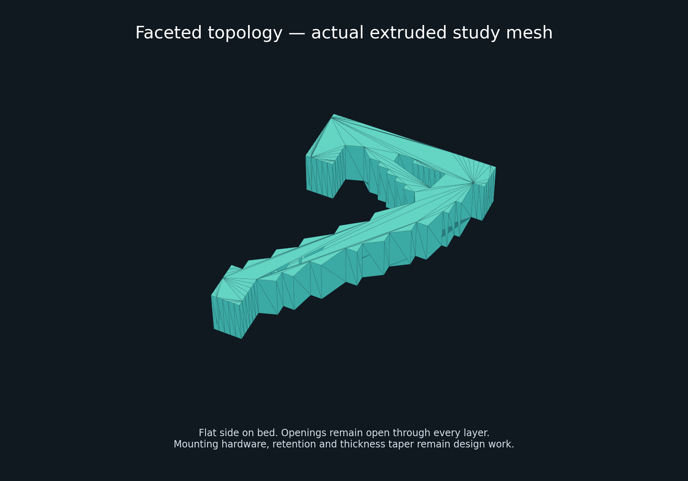

# Cloud topology experiment

This branch explores a **fanless, low-plastic PETG mount**. [Read the topology study](topology/README.md) for actual solver results, print assumptions and reproduction instructions. Study meshes are not installation-ready parts.

---

# Precision 5560 wall mount

**Revision H is the selected print model:** native FreeCAD, refined fit and finish,
and a complete oriented P1S/ASA print set. Both already-printed arms are unchanged.

[Project showcase](https://thereprocase.github.io/dell-5560-wall-mount/) ·
[Download all print files](Precision_5560_RevH_Print_Set.zip) ·
[Print set and instructions](print_release/) ·
[Editable FreeCAD model](freecad/Precision_5560_Native.FCStd) ·
[Final STEP assembly](freecad/Precision_5560_Native.step)

## Print this version

Use **print_release/**, one each of parts 01-14. STL and 3MF are alternative
formats of the same part. The complete ZIP includes both plus a SHA256 manifest.
Files have their intended orientations baked in; they are not sliced G-code.

P1S, ASA, 0.4 mm nozzle, 0.20 mm layers, 6 walls, 6 top/bottom layers,
100% infill of the explicitly hollow geometry, 8 mm outer brim, supports off.
See the [print-set instructions](print_release/README.md) and
[P1S ASA assembly guide](P1S_ASA_Print_Guide.md).

The original **print_ready/**, root STEP, CadQuery source and Fusion/Onshape ports
remain **Revision F history/baselines**. Do not confuse those with the selected
Revision H print set. The gray arm files in the new set are byte-identical to the
old ones; caps and pins are unchanged too.

## What changed

Revision H adds three R12 internal tangent blends per duct and two R14 exterior
support blends. Inlet/outlet profiles, printed arms, and 0.30 mm interfaces
remain unchanged. The other twelve parts retain the prior release geometry.
See [flow validation](freecad/flow_validation.json) for sampled wall thickness
and inlet-down overhang checks. Cooling performance has not been measured.

- Closed rail roofs and end windows while retaining the exhaust slot and open back.
- Contoured the rail shoulder with 0.30 mm clearance to the frozen printed arm.
- Rounded exposed tips, matched cover outlines, and used print-aware corner bevels.
- Set the cap/duct/tray interfaces to measured 0.30 mm gaps on both sides.
- Corrected dovetail clearance normal to the sloping flank.
- Added separate editable native loft-skin patches to close the unintended duct-wall notches.
- Preserved pin retention, fixed mounting shoulders, screw access and service motions.

Final CAD checks: **14 valid solids, 176 fully constrained sketches**, zero
additional wall loss, unchanged frozen arms, and passing sampled service paths.
All 14 print meshes are closed and their oriented bounds plus brims fit the P1S.
Physical fit, retention, ASA bridging and slicer toolpaths remain to be checked.

[Fit-and-finish review](freecad/ADJACENT_FIT_REVIEW.md) ·
[Native model guide](freecad/README.md) ·
[Final acceptance JSON](freecad/complete_fit_review.json) ·
[Print manifest](print_release/manifest.json)

## Airflow research and technical drawings

Two 120 mm fans feed the rear plenum; the upper contraction directs bypass flow
past the hinge exhaust. The project includes the original 2D slot study and a
later exploratory 3D installed-flow case with traced laptop intake assumptions.

[Seven-sheet A3 technical review](docs/simulation/installed-airflow-2026-09-07/Precision_5560_CFD_Technical_Review.pdf) ·
[Drawing package](docs/simulation/installed-airflow-2026-09-07/) ·
[3D CFD run notes](fusion/cfd/TRACED_RUN_NOTES.md) ·
[2D CFD report](CFD_Design_Report.md)

CFD is baseline exploratory evidence, not a new solve of Revision H. The 3D
case uses uncalibrated constant-force fan assumptions, no thermal solution,
and did not meet its strict convergence target. It is not a measured hardware
performance claim.

## Project history and continued work

- [Original design narrative](docs/REVISION_F_DESIGN_STORY.md)
- [FreeCAD workflow notebook](freecad/RESEARCH_NOTES.md)
- [Fusion native port and CFD work](fusion/README.md)
- [Onshape pilot and API research](onshape/README.md)
- [Engineering report](ENGINEERING_REPORT.md) and [source attribution](SOURCES.md)

The native FreeCAD document is the current editable manufacturing artifact.
Frozen arms are immutable reference geometry for any future mating-part edit.
New dimensions require renewed fit and print-orientation checks.

MIT licensed project. Third-party viewer code retains its own MIT notice.
Dell and Bambu references are attributed separately. This project is independent
of Dell, Bambu Lab and Autodesk.
