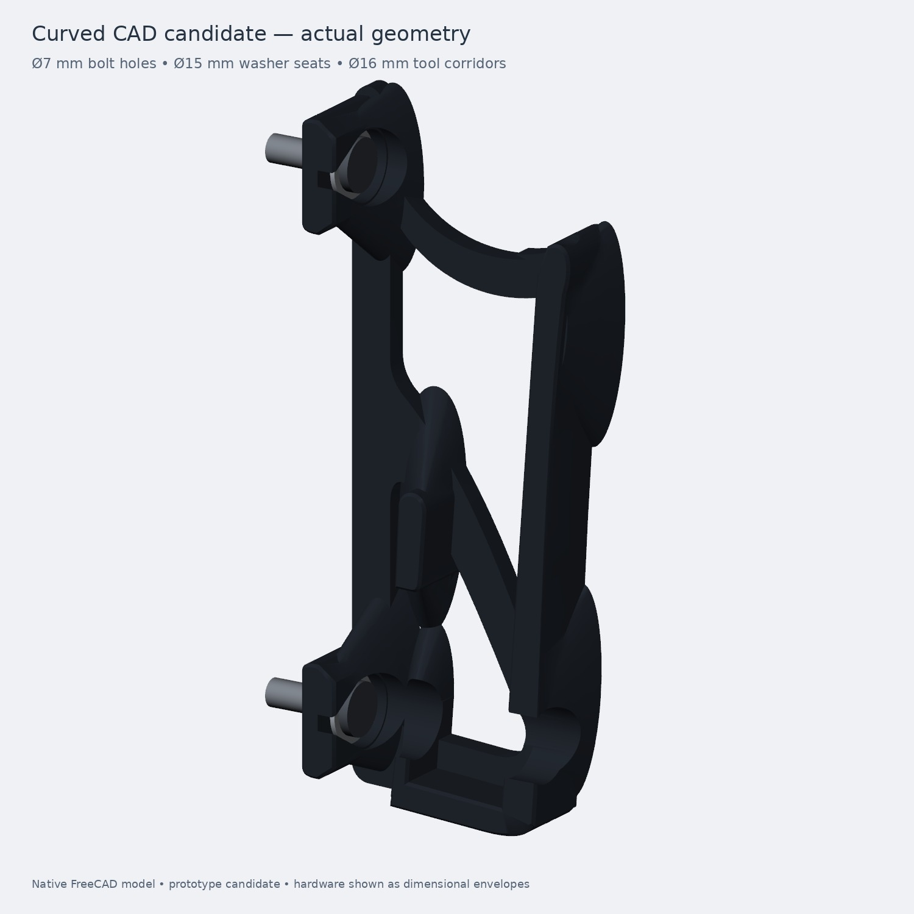

# Precision 5560 — fanless gusseted mount study

**Current cloud-topo candidate:** editable FreeCAD brackets with curved ribs and six tapered gussets per bracket, an upward-open laptop slot, four accessible wall fasteners and a support-free exterior geometry audit. The actual Orca slice predicts **57.8 g of PETG for the pair** at three 0.4 mm walls, 20% infill and five 0.2 mm top/bottom layers.

**Fit/print prototype; strength not signed off.** The refined outward-grab load case predicts about 2.64 mm movement and remains mesh-sensitive. See the evidence before treating this as an installation-ready mount.

Gussets add 7.5 g per pair and reduce screened movement by 18–40% across the finer-mesh cases. Peak grab stress remains mesh-sensitive. The [previous ungusseted candidate](topology/cad_candidate/README.md) remains available for comparison.

- [Current design, dimensions and workflow](topology/gusset_candidate/README.md)
- [Editable FreeCAD model](topology/gusset_candidate/results/Fanless_Curved.FCStd)
- [Orca sliced review project](topology/gusset_candidate/orca/curved_review.3mf)
- [Left STL](topology/gusset_candidate/results/left.stl), [right STL](topology/gusset_candidate/results/right.stl), [fit coupon](topology/gusset_candidate/results/fit_coupon.stl)
- [Installed view](topology/gusset_candidate/results/installed.jpg) and [screw access](topology/gusset_candidate/results/screw_access.jpg)
- [Validation and unresolved structural findings](topology/gusset_candidate/VALIDATION.md)
- [Running journal](topology/JOURNAL.md)

This branch follows the repository's native-CAD → fit/service checks → oriented parts → Orca review → physical verification workflow. The earlier [topology study](topology/README.md) is retained as history. The fan-cooled [Revision H on main](https://github.com/thereprocase/dell-5560-wall-mount/tree/main) is a separate baseline; its frozen printed arms and print settings do not define this fanless PETG candidate.

Reusable tooling: [portable progress journal](tools/progress-journal/README.md), with generic source and no embedded project identity.
