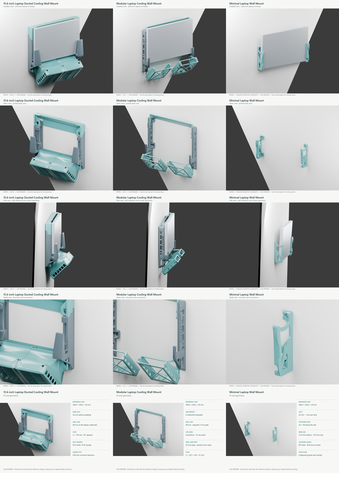

# Repro laptop wall mounts

Three model families, with native Bambu Studio projects and CAD renderings.

**Publication status:** archived for later MakerWorld publication. No MakerWorld listing or print profile has been published. The owner will finish physical prints and lab photographs before resuming. See [the agent handoff](../../MAKERWORLD_HANDOFF.md).

**Testing status:** the owner reports physically printing and trying ducted hardware. The retained arms are specifically documented as printed; this does not establish a complete Revision H assembly test. These new profiles have virtual review only. The modular and fanless designs have not yet been physically printed or tested.

## Files

### 15.6-inch Laptop Ducted Cooling Wall Mount

- [Listing description](ducted/Listing.md)
- [Model files](https://github.com/thereprocase/dell-5560-wall-mount/releases/download/makerworld-prep-2026-09-08/Repro_ducted_Model_Files.zip)
- [Bambu Studio projects, physically untested](https://github.com/thereprocase/dell-5560-wall-mount/releases/download/makerworld-prep-2026-09-08/Repro_ducted_Bambu_Studio_Projects_UNTESTED.zip)
- Five gallery images are in the `ducted` folder.

### Modular Laptop Cooling Wall Mount

- [Listing description](modular/Listing.md)
- [Model files](https://github.com/thereprocase/dell-5560-wall-mount/releases/download/makerworld-prep-2026-09-08/Repro_modular_Model_Files.zip)
- [Bambu Studio projects, physically untested](https://github.com/thereprocase/dell-5560-wall-mount/releases/download/makerworld-prep-2026-09-08/Repro_modular_Bambu_Studio_Projects_UNTESTED.zip)
- Five gallery images are in the `modular` folder.

### Minimal Laptop Wall Mount

- [Listing description](fanless/Listing.md)
- [Model files](https://github.com/thereprocase/dell-5560-wall-mount/releases/download/makerworld-prep-2026-09-08/Repro_fanless_Model_Files.zip)
- [Bambu Studio projects, physically untested](https://github.com/thereprocase/dell-5560-wall-mount/releases/download/makerworld-prep-2026-09-08/Repro_fanless_Bambu_Studio_Projects_UNTESTED.zip)
- Five gallery images are in the `fanless` folder.

## Printer and material coverage

All projects use a 0.4 mm nozzle and textured PEI plate. Each archive contains its own printer-specific toolpaths. Do not treat cached G-code as interchangeable between printers.

| Printer | PLA Basic | PETG HF | ASA |
|---|---|---|---|
| P1S | All three designs | All three designs | All three designs |
| X1C | All three designs | All three designs | All three designs |
| P2S | All three designs | All three designs | All three designs |
| H2S | All three designs | All three designs | All three designs |
| H2D | All three designs | All three designs | All three designs |
| H2C | All three designs | All three designs | All three designs |
| A1 | All three designs | All three designs | Not supplied |

A1 mini is excluded. The modular print profiles use the 5560 reference size; six measured size presets are included in its raw model bundle.

## Process settings

The projects use 0.20 mm layers, four walls, six top and bottom layers, and 20% gyroid infill. These are prototype settings, not a calculated load rating. The same shell baseline is retained across materials; temperature, cooling, flow, speed limits, and brim settings come from the selected material setup. More shells do not compensate for PLA's heat and creep limits.

The ducted projects add build-plate tree supports to the two duct objects only. They address long slot-roof edges found in Bambu's toolpaths. The other parts have supports disabled. Removal quality and sliding fit still need a physical test.

## Verification

60 native projects were generated with BambuStudio-02.07.01.62, BambuStudio-02.08.02.61. Archive integrity, saved settings, embedded toolpaths, plate thumbnails, and duct support overrides were checked. Source downloads were verified against Git blob hashes. These checks do not establish physical print quality or strength.

[Project hashes and plate counts](verification.json)

## Publish and revise

Keep one listing per design family. Add printer/material choices through print profiles rather than duplicate model pages. Use MakerWorld's supported-printer grouping where available. Do not mark an untested profile as test-printed.

Add a clear real photo of the printed object to each model gallery. Mark renders as renders. Record the source revision, print profile, material, printer, observed fit, and test conditions when updating the testing status.

MakerWorld model-photo rule: https://wiki.bambulab.com/en/makerworld/tutorials/model-upload-guidelines

Source: thereprocase/dell-5560-wall-mount. Main revision 29c666e9c02812def1e6f23a56b6115a6c3e329d; fanless cloud-topo revision 9fd0e98c43217678ce165d8f76c6a55abbf3c144. Model source license: MIT.

## Gallery and archived files

[Release downloads](https://github.com/thereprocase/dell-5560-wall-mount/releases/tag/makerworld-prep-2026-09-08) contain the large sliced projects, model bundles, listing/gallery archive, and editable render scenes. [Asset sizes and SHA-256 hashes](https://github.com/thereprocase/dell-5560-wall-mount/blob/main/makerworld/2026-09-08/release-assets.json) identify this snapshot. Keep large archives as release assets.
