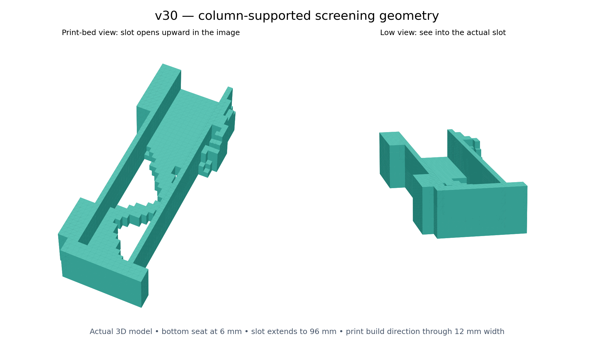

# Cloud topology journal
Latest update first. Images show actual geometry unless labeled as reference images or diagrams. Click a GitHub image to open it separately.

## Layer-aware screening — 8 mm gap superseded by hand-clearance requirement
2026-09-08T12:12:24+00:00

**Superseded clearance assumption:** the user identified that the 8 mm rear gap does not allow a comfortable fingers-behind grip. A 20 mm rear-gap trial is now running; the results below remain the 8 mm reference case. The larger gap must be included in the load lever arm.

The first layer-aware recheck is complete. For each 0.2 mm layer, I counted 1.2 mm perimeter walls, solid top/bottom regions extending five layers from each exposed surface, and 20% material in the remaining interior. This is a geometric approximation of shell thickness, not Orca-generated extrusion paths.

| Candidate | Outer volume per bracket | Outer surface area | Estimated PETG per pair | Largest loaded-point displacement across three cases |
|---|---:|---:|---:|---:|
| Full near-wall envelope | 27,072 mm³ | 11,520 mm² | 37.14 g | 0.202 mm |
| 45% design budget | 18,112 mm³ | 10,880 mm² | 30.14 g | 0.269 mm |
| 30% design budget | 15,648 mm³ | 10,128 mm² | 27.09 g | 0.315 mm |

The protected slot rails, seat and attachment pads are outside the removable design budget. The light candidate saves **42% of outer volume but only 27% of estimated plastic**. Thin members become mostly walls and skins, so volume alone exaggerates the benefit. Density is assumed 1.27 g/cm³; mass excludes hardware, pads, brim and purge.

Before rechecking I closed every retained vertical print column down to the bed. This added one 2 mm cube to the lighter candidate and three to the other. The resulting geometry only contracts with build height, so it has no geometrically unsupported outward steps. Both meshes are watertight and connected through faces. These checks do not replace inspection of slicer toolpaths or establish adhesion and strength.

The solver has explicit print axes: assumed XY modulus 1,800 MPa and Z modulus 900 MPa, with corresponding directional shear moduli. Each element is scaled using its layer-derived solid fraction plus an assumed infill stiffness proportional to density squared. This coarse homogenization is a screening model; it does not resolve extrusion paths, interlayer failure or long-term PETG creep. Rechecks physically remove deleted elements. Predicted deflections cover the three stated loads with ideal wall restraints and are not a load rating.

OrcaSlicer 2.4.2 downloaded and extracted, but its launcher failed because the cloud host lacks `libOpenGL.so.0`; the package cache also cannot resolve the requested dependencies. The geometric layer estimator is the explicitly labeled fallback. No G-code or print-ready approval is claimed.

Next design work: replace voxel steps with printable chamfered geometry, model actual screw holes and contact, verify laptop clearances, and inspect an Orca slice. The image is still a coarse screening shape.

Reproducible source: `slot_up/recheck.py`. Numeric results: `slot_up/near_wall/results/screening.json`. Per-layer areas are in `v30_layers.csv`. The state CSVs record the final retained optimization elements. The BESO casting-sector workaround is documented directly in both study scripts.

The journal now also has a single prepare-and-publish entry point, `publish_progress.js`; usage is in `PUBLISHING.md`. This entry was published through that action.

## Near-wall slot-inclusive search and one-action journal publishing
2026-09-08T12:06:26+00:00

The slot now rises from a seat just 6 mm above the bracket bottom. The near-wall trial reduces the laptop rear clearance from 28 mm to 8 mm. Top attachment pads sit near the slot top. The image below is the actual retained 3D finite-element geometry, not a generated product concept.

Both 45% and 30% design-material BESO searches finished. The mesh includes the empty laptop slot, rear/front contact rails, and three distributed load cases: a 73.575 N downward seat load; ordinary weight plus a 30 N outward load; ordinary weight plus a 20 N side load. These are exploratory assumed loads, not a verified load rating. Material axes follow print XY and Z, with assumed Z stiffness half of XY.

The optimizer currently uses a uniform stiffness scaling. It does **not yet** represent the requested 1.2 mm walls, five 0.2 mm top/bottom layers, and 20% infill layer by layer. That recheck and actual printability verification remain open. The 30% budget refers to optimization material, not slicer plastic consumption. Ideal wall clamps also still need replacement with a detailed attachment model.

Visual references: [compact laptop wall holder](https://makerworld.com/en/models/49220) for compact placement, and [organic shelf bracket](https://makerworld.com/en/models/552931-organic-shelf-bracket-topology-optimised) for load-path inspiration. No model geometry copied. The mount should hug the laptop corners; there is no established need for the earlier 28 mm gap.

Journal publishing is now scripted: prepare an entry with `journal.py`, then execute `publish_in_cloud.js` through the connected GitHub app. It uploads notes and images together, preserves the branch's existing files, checks for concurrent edits, and never force-pushes. The printed journal URL is what goes into chat.

