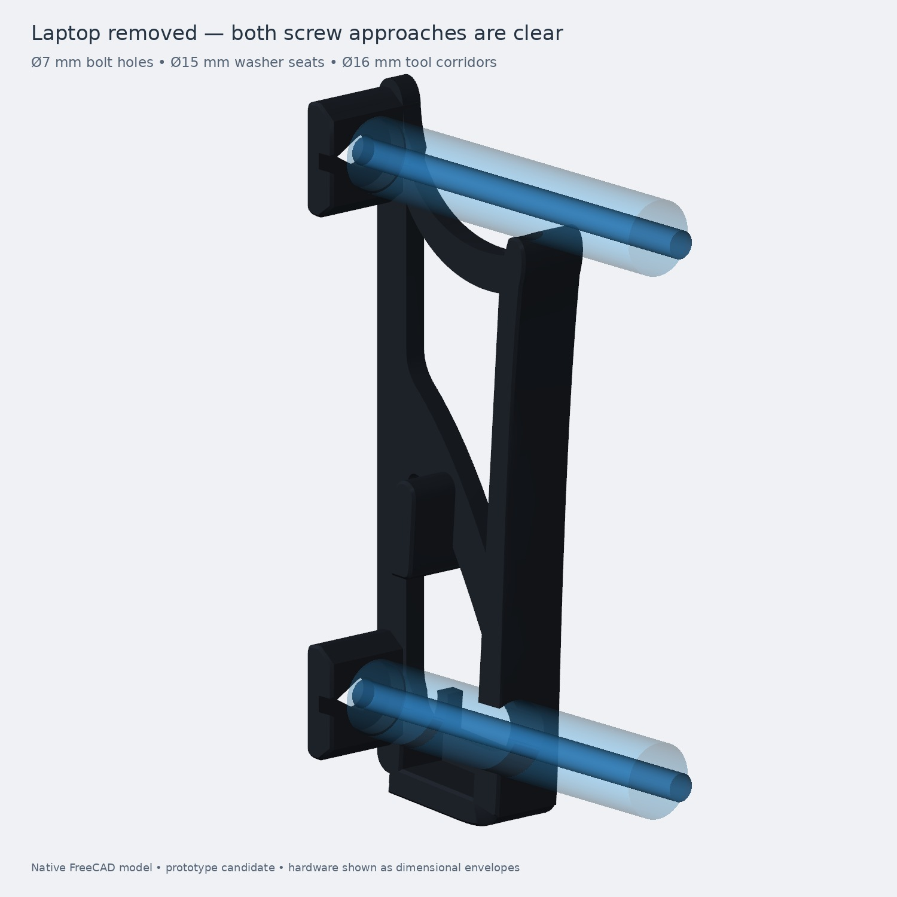
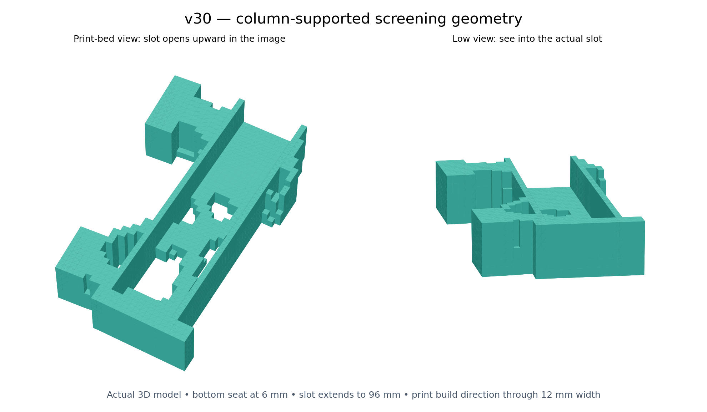
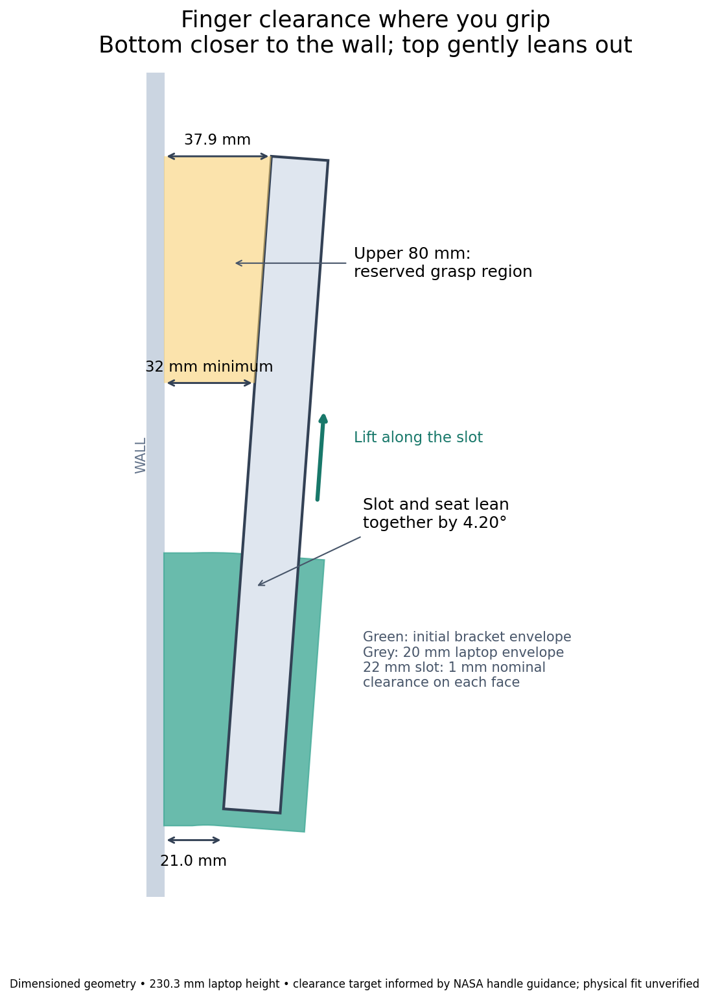

# Cloud topology journal
Latest update first. Images show actual geometry unless labeled as reference images or diagrams. Click a GitHub image to open it separately.

## Curved native CAD with real mounting and screwdriver access
2026-09-08T13:03:02+00:00

The blocky solver mesh has now become a native **FreeCAD 1.1.3 CAD candidate**. The model has a curved wall spine, two large openings, an upper sweeping brace, a diagonal rib, a tilted bottom seat and front retention rail. This is newly constructed CAD guided by the topology studies and the supplied rendering.

The repository's existing **Ø7 mm wall-hole and Ø16 mm screwdriver-corridor dimensions** are retained, with a Ø15 mm washer envelope. Each bracket has two room-facing holes. The lower driver corridor passes through a deliberate opening in the front rail. The laptop must be removed for installation. The render shows simplified screw/washer envelopes and the separate blue view shows the tool paths.

The shape is one valid solid. Exact CAD intersections are zero for both circular driver envelopes and both bolt-hole gauges. The simplified laptop envelope also clears the model at seven sampled positions along the tilted retrieval path. The upper grasp region remains above the bracket.

This follows the repository's preferred sequence: editable native CAD, named construction features, fit and service checks, oriented print files, Orca review, then a clear current-candidate handoff. The previous fan-cooled print release remains a separate design.

The native model uses stock Sketcher/Part features. The curved profiles have editable control points; they are not yet fully constrained. Shared depth dimensions are expression-driven. Broader parameter edits require regeneration and renewed checks. Slicing and structural reanalysis of this new shape are underway; the previous voxel mesh's weight and deflections do not apply to it.

## Tilted 32 mm grasp-clearance candidate — layer-aware results
2026-09-08T12:24:25+00:00

The **4.20° tilted candidate** has finished its 50-iteration 3D search and a separate layer-aware recheck. It retains the agreed **32 mm minimum rear clearance across the upper 80 mm grasp region**, with approximately **21 mm at the laptop bottom and 37.9 mm at its top**. Slot width is 22 mm for the 20 mm reference laptop envelope.

| Geometry | Outer volume per bracket | Surface area per bracket | Estimated PETG per pair | Largest loaded-point displacement |
|---|---:|---:|---:|---:|
| Full tilted envelope | 45,297 mm³ | 15,208 mm² | 53.89 g | 0.346 mm |
| Supported topology candidate | 22,568 mm³ | 13,563 mm² | 37.43 g | 0.462 mm |

That is about **50% less outer volume but 31% less estimated plastic**. Mass counts 1.2 mm perimeter walls, five 0.2 mm top/bottom layers and 20% interior material layer by layer. The transformed element polygons are used in the material calculation. This remains a geometric estimate, not slicer G-code.

The initial retained mesh needed 13 additional cells to support print columns and repair diagonal-only surface contacts. The rechecked shape is one face-connected component with a watertight, consistently wound surface; mesh volume agrees with summed element volumes. Its cross-section does not grow outward as print Z increases. This supports the conservative no-bridge/no-outward-overhang geometry objective, while leaving actual Orca toolpath verification open.

The three rechecked load cases give maximum loaded-point displacements of **0.167 mm** for the 73.575 N downward case, **0.334 mm** for ordinary weight plus 30 N outward force, and **0.462 mm** for ordinary weight plus 20 N side force. These are results of the assumed orthotropic PETG model and ideal wall restraints, not experimentally verified stiffness or a strength rating. Long-term creep and explicit contact are not modeled.

Current evidence and source:

- [Dimensions and grip diagram](slot_up/tilted_grip/results/grip_layout.png)
- [Numeric screening results](slot_up/tilted_grip/results/screening.json)
- [Layer-by-layer areas](slot_up/tilted_grip/results/v30_layers.csv)
- [Retained element states](slot_up/tilted_grip/results/v30_final_states.csv)
- [Intermediate screening STL](slot_up/tilted_grip/results/v30_screening.stl)
- [Reproduction instructions](slot_up/README.md)
- [Human-factors references and selected constraints](HUMAN_FACTORS.md)

The STL is an intermediate topology shape. Final screw holes, chamfers, pads/fit, PETG handling feel and an Orca slice are still outstanding. Hand clearance is a design target informed by the NASA drawing; personal fit is not yet tested.

## NASA-informed grip clearance and a 4.2 degree outward lean
2026-09-08T12:20:51+00:00

The user accepted a **32 mm grasp-clearance target**, informed by the NASA two-finger handle drawing, and suggested leaning the laptop slightly away from the wall. The updated geometry combines both: **4.20° tilt**, approximately **21.0 mm rear clearance at the bottom**, and **32.0–37.9 mm over the upper 80 mm grasp region**. This uses the repository's 230.3 mm laptop height. A 22 mm slot allows nominal 1 mm clearance on each face of the 20 mm reference laptop envelope.

The seat and slot rotate together; wall attachment pads remain against the wall. Retrieval follows the tilted slot, requiring about 90 mm upward travel along it before the bottom clears the rails. The actual print build axis is unchanged. A slot-inclusive 3D BESO search is running with these coordinates and the three existing distributed load cases. The image is a dimensioned geometry diagram, not an optimized final shape.

The research and design rules are now in [HUMAN_FACTORS.md](HUMAN_FACTORS.md), with machine-readable targets in [handling_requirements.json](handling_requirements.json). The useful sources are:

- [NASA HIDH, Fig. 9.7-4, p. 833](https://www.nasa.gov/wp-content/uploads/2015/03/human_integration_design_handbook_revision_1.pdf#page=838): distinguishes a 19 mm fingertip opening from a 32 mm two-finger bar clearance and roughly 48–50 mm full-hand handle clearance. These shapes are different; none is a universal laptop-gap requirement.
- [FAA HF-STD-001B, §§5.2.2.5–5.2.2.8](https://hf.tc.faa.gov/publications/2016-12-human-factors-design-standard/full_text.pdf): grasp locations, finger curl, clearance, and alignment guides/stops.
- [U.S. Access Board, door hardware](https://www.access-board.gov/ada/guides/chapter-4-entrances-doors-and-gates/): 38.1 mm knuckle-clearance recommendation for pulls, useful as a comparison.
- [CCOHS hand-tool design](https://www.ccohs.ca/oshanswers/ergonomics/handtools/tooldesign.html): grip force, neutral wrists, contact surfaces and friction.

For this personal mount, the selected dimensions are informed engineering choices, not a claim of NASA compliance or verified human fit. Keep the upper side edges exposed, provide chamfered lead-ins and touch edges, and keep fingers above the closing seat gap. A supported spacer check and a small PETG fit coupon remain necessary before treating the shape as ready for use.

## Layer-aware screening — 8 mm gap superseded by hand-clearance requirement
2026-09-08T12:12:24+00:00

**Superseded clearance assumption:** the user identified that the 8 mm rear gap does not allow a comfortable fingers-behind grip. A 20 mm rear-gap trial is now running; the results below remain the 8 mm reference case. The larger gap must be included in the load lever arm.

The first layer-aware recheck is complete. For each 0.2 mm layer, I counted 1.2 mm perimeter walls, solid top/bottom regions extending five layers from each exposed surface, and 20% material in the remaining interior. This is a geometric approximation of shell thickness, not Orca-generated extrusion paths.

| Candidate | Outer volume per bracket | Outer surface area | Estimated PETG per pair | Largest loaded-point displacement across three cases |
|---|---:|---:|---:|---:|
| Full near-wall envelope | 27,072 mm³ | 11,520 mm² | 37.14 g | 0.202 mm |
| 45% design budget | 18,112 mm³ | 10,880 mm² | 30.14 g | 0.269 mm |
| 30% design budget | 15,648 mm³ | 10,128 mm² | 27.09 g | 0.315 mm |

The protected slot rails, seat and attachment pads are outside the removable design budget. The light candidate saves **42% of outer volume but only 27% of estimated plastic**. Thin members become mostly walls and skins, so volume alone exaggerates the benefit. Density is assumed 1.27 g/cm³; mass excludes hardware, pads, brim and purge.

Before rechecking I closed every retained vertical print column down to the bed. This added one 2 mm cube to the lighter candidate and three to the other. The resulting geometry only contracts with build height, so it has no geometrically unsupported outward steps. Both meshes are watertight and connected through faces. These checks do not replace inspection of slicer toolpaths or establish adhesion and strength.

The solver has explicit print axes: assumed XY modulus 1,800 MPa and Z modulus 900 MPa, with corresponding directional shear moduli. Each element is scaled using its layer-derived solid fraction plus an assumed infill stiffness proportional to density squared. This coarse homogenization is a screening model; it does not resolve extrusion paths, interlayer failure or long-term PETG creep. Rechecks physically remove deleted elements. Predicted deflections cover the three stated loads with ideal wall restraints and are not a load rating.

OrcaSlicer 2.4.2 downloaded and extracted, but its launcher failed because the cloud host lacks `libOpenGL.so.0`; the package cache also cannot resolve the requested dependencies. The geometric layer estimator is the explicitly labeled fallback. No G-code or print-ready approval is claimed.

Next design work: replace voxel steps with printable chamfered geometry, model actual screw holes and contact, verify laptop clearances, and inspect an Orca slice. The image is still a coarse screening shape.

Reproducible source: `slot_up/recheck.py`. Numeric results: `slot_up/near_wall/results/screening.json`. Per-layer areas are in `v30_layers.csv`. The state CSVs record the final retained optimization elements. The BESO casting-sector workaround is documented directly in both study scripts.

The journal now also has a single prepare-and-publish entry point, `publish_progress.js`; usage is in `PUBLISHING.md`. This entry was published through that action.

## Near-wall slot-inclusive search and one-action journal publishing
2026-09-08T12:06:26+00:00

The slot now rises from a seat just 6 mm above the bracket bottom. The near-wall trial reduces the laptop rear clearance from 28 mm to 8 mm. Top attachment pads sit near the slot top. The image below is the actual retained 3D finite-element geometry, not a generated product concept.

Both 45% and 30% design-material BESO searches finished. The mesh includes the empty laptop slot, rear/front contact rails, and three distributed load cases: a 73.575 N downward seat load; ordinary weight plus a 30 N outward load; ordinary weight plus a 20 N side load. These are exploratory assumed loads, not a verified load rating. Material axes follow print XY and Z, with assumed Z stiffness half of XY.

The optimizer currently uses a uniform stiffness scaling. It does **not yet** represent the requested 1.2 mm walls, five 0.2 mm top/bottom layers, and 20% infill layer by layer. That recheck and actual printability verification remain open. The 30% budget refers to optimization material, not slicer plastic consumption. Ideal wall clamps also still need replacement with a detailed attachment model.

Visual references: [compact laptop wall holder](https://makerworld.com/en/models/49220) for compact placement, and [organic shelf bracket](https://makerworld.com/en/models/552931-organic-shelf-bracket-topology-optimised) for load-path inspiration. No model geometry copied. The mount should hug the laptop corners; there is no established need for the earlier 28 mm gap.

Journal publishing is now scripted: prepare an entry with `journal.py`, then execute `publish_in_cloud.js` through the connected GitHub app. It uploads notes and images together, preserves the branch's existing files, checks for concurrent edits, and never force-pushes. The printed journal URL is what goes into chat.

