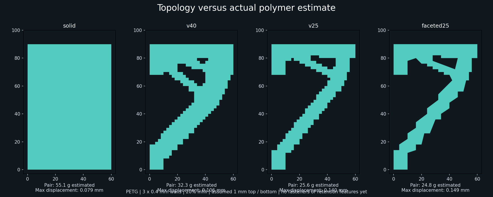

# Fanless laptop mount: first topology experiment

This branch explores two lightweight corner brackets for the Dell 5560. The first run uses a 60 × 90 × 10 mm side-profile envelope per bracket. CalculiX and BESO completed two searches on the cloud CPU. These are topology studies, not installation-ready mounts: the preserved wall interfaces are ideal supports, without designed screw holes, and the saddle still needs padding and retention features.




## User constraints

- PETG; three walls at 0.4 mm line width; 20% infill.
- Low filament use, easy printing, no unsupported roofs or bridges.
- Outward slopes up to 30° from build vertical preferred; 45° locally subject to slicer review. Inward slopes acceptable. Prefer chamfers to fillets.
- No fans, ducts or connecting backplate.

This first pass extrudes a planar topology 10 mm thick. It lies flat on its broad side, and all openings pass through the full build height. Variable thickness, chamfers through thickness, bolt attachment and retention remain subsequent design work. The user permits non-flat designs; flat extrusion is an initial search restriction, not a final requirement.

## What actually ran

Headless BESO uses CalculiX 2.21 with 1,350 CPS4 plane-stress elements, 2 mm pitch, and two independent load cases. It preserves two wall-interface blocks and the 26 × 10 mm saddle region. All displacements at the wall-edge support nodes are fixed in-plane.

Loads per bracket: (1) 73.575 N downward plus 30 N outward; (2) 30 N upward plus 50 N outward. The gravity allowance is the entire assumed 2.5 kg laptop at 3g on one bracket. Handling loads are chosen screening assumptions, not measurements. Forces distribute over 11 saddle nodes. These cases do not evaluate lateral loads, layer separation or fastener behavior.

The search uses a uniform assumed equivalent modulus of 1,000 MPa, Poisson ratio 0.35, a 4 mm sensitivity filter and a soft-void material. BESO uses the maximum element strain-energy density across load cases. It targets 40% and 25% retained volume in the **modifiable domain**, excluding preserved interfaces. Both runs reached iteration 55; neither is claimed to meet the configured 0.1% objective-stability criterion or to establish a global optimum. The filter is not a guaranteed minimum-member-thickness constraint.

## Perimeters change the answer

We estimated polymer from the complete profile, including every opening perimeter. Assumptions beyond the user's settings: 0.2 mm layers, five top layers, five bottom layers, 1.27 g/cm³ PETG density. For profile area A and inward-offset core area Ai at 1.2 mm:

`polymer volume = A × 10 − (1 − 0.20) × Ai × (10 − 2 × 1)`

This counts overlapping shells geometrically and includes the top and bottom skins. It excludes purge, brim, variable line widths, infill/wall overlap and slicer-specific paths. These are **estimates, not OrcaSlicer results**. OrcaSlicer was not available or run.

| Candidate | Pair polymer estimate | Maximum displacement in recheck |
|---|---:|---:|
| Full envelope with specified infill | 55.14 g | 0.0794 mm |
| 40% design-domain budget | 32.26 g | 0.1055 mm |
| 25% design-domain budget | 25.62 g | 0.1404 mm |
| Faceted 25% profile | 24.78 g | 0.1490 mm |

The faceted profile has slightly **more** CAD volume than the raw 25% profile (18,180 versus 18,120 mm³ per bracket), but less estimated filament because its perimeter drops from 464 to 418 mm. It estimates about 55% less polymer than the filled-envelope baseline. These masses exclude unmodeled mounting and retention details.

BESO optimizes a volume-based stiffness objective. The perimeter-aware estimate ranks and improves its candidates afterward; it is not an integrated filament-minimizing topology optimizer.

## Shell/infill recheck

Each retained profile is re-analyzed with void cells removed, rather than relying on BESO's soft-void stiffness. Local effective modulus depends on wall coverage, top/bottom skin fraction and an infill modulus proxy. We assume 1,800 MPa dense PETG modulus and `E_infill/E_dense = 0.20²`, then average stiffness through thickness. This is an intentionally low infill-stiffness assumption, not a validated bound or measured material model. The Poisson ratio remains 0.35.

The faceted contour uses 1.5 mm polygon simplification and restores all protected regions. Its center-selected FE grid has 0.99% more area than the polygon. Both source and faceted profiles were checked for a single face-connected FE component. Exported STL meshes are watertight, consistently wound, and have positive volume matching profile area × thickness.

The faceted candidate's peak homogenized von Mises stress is 2.55 MPa. **This is not the stress in individual extrusion paths or a strength qualification.** The model does not resolve orthotropic raster behavior, layer adhesion, nonlinear contact, buckling, creep or temperature. No mesh-convergence study was performed. The finished anchor details will change the load paths.

## Reproduce

On Ubuntu 24.04 x86_64 with Python 3.12, git and dpkg-deb:

```sh
python topology/bootstrap.py
topology/runtime/venv/bin/python topology/run_pipeline.py
```

The bootstrap extracts SHA-256-pinned Ubuntu packages into an ignored local runtime and clones the exact BESO commit recorded in `results/environment.json`. It does not use apt or change system libraries. Python requirements are pinned. Network access is required for first setup. The study refuses to overwrite an existing run; move `topology/work` aside to repeat it. Numerical outputs can vary with library/CPU versions.

The original cloud execution used these same extracted distro packages and the pinned BESO checkout with the primary Python runtime. The package manifest and Python requirements capture that environment. `results/*_beso_conf.py` preserve original execution paths for provenance; the generator creates portable new configurations.

## Files and next decisions

- `run_study.py`: geometry, supports, loads and BESO configuration.
- `analyze_results.py`: geometric polymer estimate, shell/infill re-analysis, actual STL and figures.
- `results/summary.json`: numeric results and geometry checks.
- `results/*_states.csv`, `*_history.log`: retained elements and search history.
- `results/*_fdm_check.inp`: re-analysis inputs; `results/solver_evidence.zip`: raw `.dat`, `.frd` and supporting solver outputs.
- `results/*_study.stl`, `*_profile.svg`: **study geometry**, not a print release.

Next: choose a screw/cleat interface and retention concept compatible with support-free printing; add lateral and layer-direction load cases; optimize/chamfer thickness; resolve small topology necks; slice in OrcaSlicer using the user's settings; compare actual filament and supported layer geometry; then test a printed bracket under sustained load.

Sources: [BESO](https://github.com/calculix/beso), [CalculiX](https://www.dhondt.de/), and the parent repository's 2.5 kg laptop screening assumption. This branch changes no released mount geometry.
