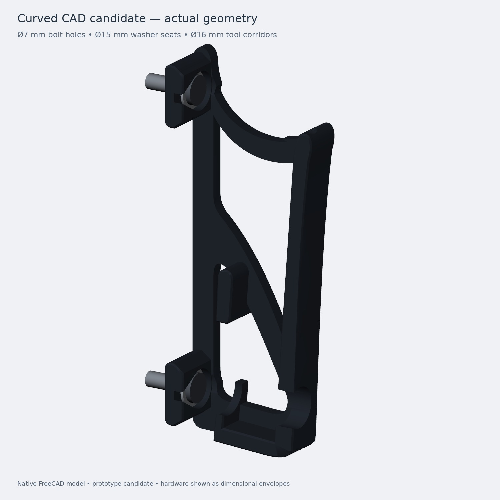

# Fanless curved CAD candidate — review build

This is the current **cloud-topo** design: two mirrored PETG brackets with a curved side frame, large openings, a bottom seat and a slot open at the top. It reconstructs the earlier topology study as editable CAD. **It is a fit/print prototype, not a strength-qualified installation release.**



## Open and review

- [Native FreeCAD 1.1.3 model](results/Fanless_Curved.FCStd)
- [OrcaSlicer 2.4.2 sliced review project](orca/curved_review.3mf)
- [Left STL](results/left.stl), [right STL](results/right.stl), [fit coupon STL](results/fit_coupon.stl)
- [Left STEP](results/left.step), [right STEP](results/right.step)
- [Installed view](results/installed.jpg), [screw access view](results/screw_access.jpg)
- [Evidence and limitations](VALIDATION.md)

The repository's desirable flow is native editable CAD → dimension/fit/service checks → oriented meshes → Orca toolpath review → physical coupon → physical load/creep validation → clearly identified release. This branch now follows that flow. The existing fan-cooled Revision H on main remains a separate project baseline.

## Fit and mounting

| Detail | Candidate |
|---|---:|
| Laptop reference envelope | 344.4 × 230.3 × 20 mm |
| Slot, normal to laptop faces | 22 mm |
| Nominal face clearance | 1 mm each face |
| Side clearance | 0.5 mm each side |
| Outward lean | 4.198° |
| Minimum rear clearance in upper 80 mm grasp region | 32 mm |
| Rear clearance at laptop bottom / top | 21.0 / 37.9 mm |
| Main side web / contact reach / mounting-pad reach | 4.8 / 16 / 24 mm |
| Bolts | Four total, Ø7 mm clearance |
| Washer envelope / tool corridor | Ø15 / Ø16 mm |
| Vertical hole spacing | 114 mm |

The NASA-derived grasp clearance is a design choice documented in [human factors](../HUMAN_FACTORS.md), not a universal laptop-mount requirement. The broad upper grasp region remains above the bracket. The laptop slides down along the 4.2° tilted slot; lift along that same direction to remove it. Allow overhead space for this motion.

Print the small coupon first and check the actual laptop edge, selected bolt/washer/head and driver. The coupon contains the real lower seat and mounting opening. Padding consumes the nominal 1 mm face clearance; pad thickness has not been added as extra clearance. Port/cable and lid-opening access have not been qualified.

Attach the brackets with the laptop removed. Approach both screws straight from the room through the illustrated tool corridors. Use the chosen wall anchoring system's installation requirements; the CAD defines clearance envelopes, not an anchor rating. The teardrop roofs preserve circular tool/washer clearance while avoiding a flat printed roof. Simplified hardware in the pictures is dimensional illustration.

## Print setup

Orca's actual slice predicts **50.28 g for the pair**, excluding the separate coupon. Use a P1S with 0.4 mm nozzle, PETG, 0.20 mm layers including the first layer, three walls with all specified widths at 0.4 mm, 20% gyroid, five top and five bottom layers with 1 mm minimum thickness and ensure shell thickness. Supports and brim are off. The included project uses the textured PEI plate and Generic PETG as a starting material profile; tune temperature/flow to the actual filament.

Both full parts are already bed oriented, broad outer cheek down. Preserve that orientation. The pair fits the P1S plate. Review/re-slice the 3MF in your Orca installation before printing; no standalone printer-ready G-code is supplied as a release.

The exterior layer audit finds no area outside a 30° expansion envelope (0.025 mm tessellation allowance). This does not eliminate the normal short spans of solid skins over sparse infill. Physical PETG behavior remains to be tested.

## Native editing and reproduction

The FreeCAD document uses stock Sketcher, Part, Spreadsheet and Link objects. It reopens without a custom Python feature proxy. Six fastener-tool sketches are fully constrained; the ten frame/profile sketches have editable cubic control points and are **not fully constrained**.

Web/contact/pad extrusion depths, fastener diameters and positions have named expressions. Only the hole-diameter change was perturbation-tested. The wall-thickness entry controls tool offsets, not the pad outline. Slot width, tilt, laptop envelope and other reference entries document the design: change the geometry recipe when altering those. The sheet is not a promise of arbitrary automatic resizing. Re-run fit, print and load checks after edits.

1. Run `build_native.py` using FreeCAD 1.1.3's bundled Python with its `usr/lib` on Python/library paths, then `finalize_native.py`. The latter reopens the file, changes the hole from 7 to 7.4 mm, restores it and exports the native fit coupon.
2. Install `requirements.txt` in a separate Python environment for mesh audits/rendering. CalculiX is a separate executable at `../runtime/usr/bin/ccx`, with its runtime libraries beside it; see the parent topology setup. `check_structure.py` uses the parent's `slot_up/recheck.py` parser.
3. Run `prepare_orca.py /path/to/OrcaSlicer/resources`. Then run the CLI command below from this directory. Orca's resource/profile directory and its platform dependencies must be available.
4. Run `check_layers.py` after Orca finishes, then `check_structure.py 2.5`, `1.8` and `1.2` in order. `render_review.py` renders the exported STL with VTK; headless Linux may need EGL/Mesa.

```sh
orca-slicer --load-settings 'orca/machine.json;orca/process.json' \
  --load-filaments orca/filament.json --arrange 1 --orient 0 --slice 0 \
  --outputdir orca --export-3mf curved_review.3mf \
  results/left.stl results/right.stl
```

Keep candidate evidence in this directory and publish through the existing [one-action journal workflow](../PUBLISHING.md). Do not substitute historical voxel displacements or Revision H print settings for this candidate's results/settings.
